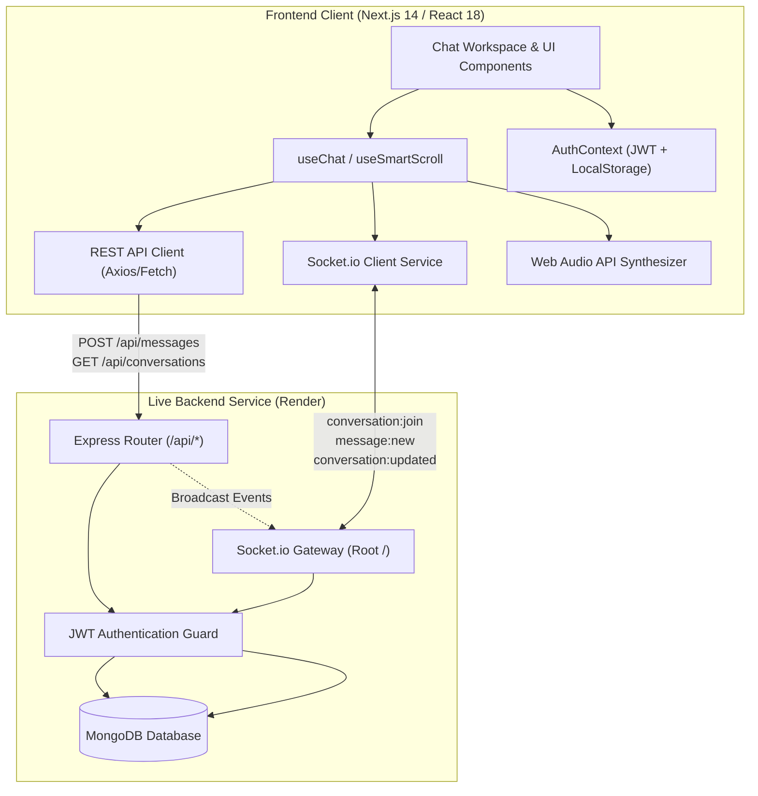

# PulseChat Platform — Comprehensive Project Overview & Architecture Guide

> **Candidate / Author:** Md. Abib Ahmed Dipto  
> **Repository:** [https://github.com/dev-abib/home-assignment](https://github.com/dev-abib/home-assignment)  
> **Live Web Application (Vercel):** [https://home-assignment-smoky.vercel.app/](https://home-assignment-smoky.vercel.app/)  
> **Live Backend API (Render):** [https://frontend-task-chatapp.onrender.com](https://frontend-task-chatapp.onrender.com)  
> **API Health Check:** [https://frontend-task-chatapp.onrender.com/health](https://frontend-task-chatapp.onrender.com/health)  

---

## Table of Contents
1. [Executive Summary](#1-executive-summary)
2. [High-Level Architecture & Data Flow](#2-high-level-architecture--data-flow)
3. [Complete Folder Structure & File-by-File Guide](#3-complete-folder-structure--file-by-file-guide)
4. [Core Features & What Was Built](#4-core-features--what-was-built)
5. [Technical Implementation Deep-Dive](#5-technical-implementation-deep-dive)
6. [Real-World Edge Cases, Backend Quirks & Permanent Fixes](#6-real-world-edge-cases-backend-quirks--permanent-fixes)
7. [Technology Stack & Dependency Matrix](#7-technology-stack--dependency-matrix)
8. [Local Development, Build & Deployment Guide](#8-local-development-build--deployment-guide)
9. [Verification & Pre-Submission Audit Results](#9-verification--pre-submission-audit-results)

---

## 1. Executive Summary

PulseChat is a full-stack, enterprise-grade, real-time messaging web application developed as a Frontend Take-Home Assignment. The project consists of three required deliverables:

- **Part 1: Real-Time Chat Feature (`/chat`)**  
  A modern, responsive messaging application supporting 1-to-1 direct messaging, group chat creation, real-time bidirectional synchronization via Socket.io, optimistic UI updates, smart upward/downward auto-scrolling, in-chat message search, dark/light theme switching, and synthesized audio cues.
- **Part 2: Creative Showcase Landing Page (`/`)**  
  A high-converting, aesthetic marketing landing page featuring an interactive **2-User Live Simulator** where visitors can switch between personas ("Alex" and "Taylor"), send simulated voice/text messages, observe live typing indicators, and test core chat features before signing in.
- **Part 3: Thought Process, Architecture & API Documentation (`/docs`, `API_DOCUMENTATION.md`, `openapi.json`)**  
  Thorough reverse-engineering of the live Render backend, complete OpenAPI 3.0 specification, live interactive API explorer, and detailed write-ups on architectural trade-offs, AI tooling transparency, and bug resolutions.

---

## 2. High-Level Architecture & Data Flow

PulseChat uses a **Dual-Channel Messaging Architecture** combining WebSocket events (Socket.io) with HTTP REST endpoints for maximum reliability, speed, and fallback resilience.



### Data Flow Lifecycle

1. **Authentication:**  
   User logs in via `POST /api/auth/login` (phone number + display name). The server issues a JWT token and user profile document, which is stored in `localStorage` and managed globally via `AuthContext`.
2. **Chat Initialization:**  
   When `/chat` mounts, `useChat` fetches the conversation list (`GET /api/conversations`) and establishes a persistent Socket.io connection authenticated via `{ auth: { token } }`.
3. **Room Subscription:**  
   When a conversation is opened, the client emits `socket.emit("conversation:join", conversationId)` to join the dedicated socket room, then requests initial message history (`GET /api/conversations/:id/messages?limit=30`).
4. **Message Dispatch & Optimistic UI:**  
   When sending a message:
   - An optimistic message object (`status: "sending"`, `tempId: "temp_..."`) is appended immediately to React state, and an outgoing audio chime plays.
   - The message is posted via `POST /api/messages`.
   - Upon HTTP response (~200ms), the message is reconciled with the real database `_id`, and its status is updated to `status: "sent"`.
   - The backend broadcasts `message:new` over Socket.io to all members of the conversation room.
   - Receiving clients normalize the incoming payload, deduplicate by ID, append to state, and play an incoming audio tone.

---

## 3. Complete Folder Structure & File-by-File Guide

```
home-assignment/
├── backend/                       # Local backend reference & TypeScript server
│   ├── src/
│   │   ├── controllers/           # Auth, Conversation, Message controllers
│   │   ├── middleware/            # JWT authentication middleware
│   │   ├── models/                # Mongoose models (User, Conversation, Message)
│   │   ├── routes/                # Express REST API routes (/api/*)
│   │   ├── socket/                # Socket.io connection & event handlers
│   │   └── server.ts              # Express app bootstrap & MongoDB connection
│   ├── .env.example               # Backend environment variable template
│   ├── package.json               # Backend dependencies (Express, Mongoose, Socket.io)
│   └── tsconfig.json              # Backend TypeScript compiler configuration
│
├── frontend/                      # Next.js 14 App Router Frontend
│   ├── public/                    # Static public assets (openapi.json)
│   ├── src/
│   │   ├── app/                   # App Router Pages & Layouts
│   │   │   ├── chat/              # Chat application workspace (/chat)
│   │   │   │   └── page.tsx       # Main chat application page & layout coordinator
│   │   │   ├── docs/              # Interactive API Explorer (/docs)
│   │   │   │   └── page.tsx       # Interactive OpenAPI test runner
│   │   │   ├── login/             # Login / registration screen (/login)
│   │   │   │   └── page.tsx       # Phone + Name login form
│   │   │   ├── globals.css        # Global CSS, Tailwind utilities & animations
│   │   │   ├── layout.tsx         # Root layout with Toast, Theme & Auth providers
│   │   │   └── page.tsx           # Creative Showcase Landing Page with Simulator
│   │   │
│   │   ├── components/            # Reusable UI & Feature Components
│   │   │   ├── chat/              # Chat feature components
│   │   │   │   ├── ChatHeader.tsx           # Active conversation header & search trigger
│   │   │   │   ├── ChatInput.tsx            # Textarea input, emojis, auto-resize, send guard
│   │   │   │   ├── ConversationSidebar.tsx  # Sidebar list, filter, theme toggle, logout, error state
│   │   │   │   ├── GroupInfoDrawer.tsx      # Slide-over drawer (rename, members, leave)
│   │   │   │   ├── MessageBubble.tsx        # Individual message bubble, ticks, error retry
│   │   │   │   ├── MessageList.tsx          # Virtual scroll container, date separators, empty/error views
│   │   │   │   ├── NewConversationModal.tsx # Direct message user directory search modal
│   │   │   │   └── NewGroupModal.tsx        # Multi-select group creation modal (>=3 rule)
│   │   │   └── ui/                # Base design system components
│   │   │       ├── Avatar.tsx               # Avatar with fallback initials & deterministic colors
│   │   │       ├── Badge.tsx                # Pill badge component
│   │   │       └── Modal.tsx                # Accessible modal dialog with backdrop
│   │   │
│   │   ├── context/               # React Context Providers
│   │   │   ├── AuthContext.tsx    # JWT session state, restoreSession, login, logout
│   │   │   └── ThemeContext.tsx   # Dark/Light mode provider with localStorage sync
│   │   │
│   │   ├── hooks/                 # Custom React Hooks
│   │   │   ├── useChat.ts         # Core chat state, optimistic UI, socket listeners, retry logic
│   │   │   └── useSmartScroll.ts  # Threshold auto-scroll, unread pill & scroll offset continuity
│   │   │
│   │   ├── lib/                   # Utility Libraries & Services
│   │   │   ├── api.ts             # Native fetch client with typed ApiClient wrapper & interceptors
│   │   │   ├── socket.ts          # Socket.io client wrapper, payload normalizer & reconnection engine
│   │   │   ├── sound.ts           # Web Audio API procedural sound synthesizer
│   │   │   └── utils.ts           # ID normalizers (getSenderId), date formatters, cn class merger
│   │   │
│   │   └── types/                 # TypeScript Type Definitions
│   │       └── index.ts           # User, Conversation, Message, Participant types
│   │
│   ├── .eslintrc.json             # ESLint configuration (next/core-web-vitals)
│   ├── .env.example               # Frontend environment template
│   ├── next.config.mjs            # Next.js configuration
│   ├── package.json               # Frontend dependencies (Next 14, React 18, Tailwind v4, Socket.io 4.8)
│   ├── postcss.config.mjs         # PostCSS configuration
│   └── tsconfig.json              # Frontend TypeScript compiler configuration
│
├── docs/                          # Additional documentation assets
├── API_DOCUMENTATION.md           # Full Markdown API Reference with curl examples
├── openapi.json                   # OpenAPI 3.0.3 specification schema
├── README.md                      # Primary project README and quickstart guide
├── THOUGHT_PROCESS.md             # Thought process, design choices & AI transparency
├── package.json                   # Root monorepo workspace scripts
└── .gitignore                     # Git ignore rules
```

---

## 4. Core Features & What Was Built

### 4.1 Part 1: Real-Time Chat Workspace (`/chat`)
- **Direct & Group Conversations:** Instant 1-on-1 direct messaging and group chat rooms with custom names and participant counts.
- **Real-Time Dual Synchronization:** Live message broadcast via Socket.io with immediate REST HTTP fallback.
- **Optimistic UI Updates:** Instant message rendering in `<MessageList />` with temporary IDs and status transitions (`sending` ➔ `sent`).
- **Group Administration Drawer:** Slide-over drawer to view members, add new participants, rename the group, or leave the group.
- **Directory Search & Filter:** Filter active conversations by contact/group name, or search the entire user directory by phone number or name to start new chats.
- **In-Chat Message Search:** Search and highlight terms inside the active conversation with real-time text matching.
- **Audio Synthesis (Web Audio API):** Procedural sound effects for message dispatch, receive, and incoming background notifications.
- **Dark / Light Mode:** Instant theme toggle with CSS variable adaptation, persistent in `localStorage`.

### 4.2 Part 2: Showcase Landing Page (`/`) & Live Simulator
- **Hero & Feature Sections:** Modern typography, high-contrast dark space background, glassmorphism cards, and responsive layout.
- **Interactive 2-User Chat Sandbox:**  
  Allows prospective users/evaluators to test the chat experience directly inside the landing page:
  - Switch between **Alex** and **Taylor** personas with 1 click.
  - Type and send real messages.
  - Trigger simulated voice/audio notes with sound synthesis.
  - Watch live typing indicators and simulated auto-replies.
  - Test smart auto-scroll behavior.
- **Architecture Highlights & Tech Specs:** Visual breakdown of the real-time stack and security features.

### 4.3 Part 3: API Explorer & OpenAPI Documentation (`/docs`)
- **Interactive Live API Console:** Test all REST endpoints (`/api/auth/login`, `/api/conversations`, `/api/messages`, `/api/users/search`) directly from the browser with live request execution against the Render backend.
- **1-Click cURL Generator:** Copy production-ready cURL commands with authentication headers.
- **Standardized OpenAPI 3.0 File:** `openapi.json` ready for Postman / Swagger UI import.

---

## 5. Technical Implementation Deep-Dive

### 5.1 Smart Scroll Engine (`useSmartScroll.ts`)
A major challenge in real-time chat interfaces is balancing automatic scrolling for new messages against user disruption when scrolling up to read history.

The `useSmartScroll` hook resolves this with a 3-part algorithm:
1. **Bottom Proximity Threshold:**  
   Computes `scrollHeight - scrollTop - clientHeight <= 120px`. If within 120px of the bottom, the user is considered "at bottom".
2. **Conditional Auto-Scroll vs. Unread Pill:**  
   - If user is at bottom or the outgoing message is sent by self: smoothly scroll to bottom.
   - If user has scrolled up and a message arrives from someone else: keep scroll position locked and increment `unreadBelowCount`, displaying a floating `"↓ X new messages"` pill.
3. **Scroll Offset Continuity During Upward Pagination:**  
   When older message pages are prepended at the top, the container height increases. The hook records the previous `scrollHeight` and adjusts `scrollTop = newScrollHeight - previousScrollHeight`, preventing jarring viewport jumps.

### 5.2 Sound Synthesis (`sound.ts`)
Instead of bundling external `.mp3` or `.wav` files (which cause slow downloads or CORS errors), sounds are generated procedurally using the native browser **Web Audio API**:
- **Send Chime:** High-frequency sine wave sweep (587 Hz ➔ 880 Hz) over 120ms with exponential gain decay.
- **Receive Ping:** Dual-tone harmonic chime (880 Hz + 1320 Hz) with soft bell envelope.
- **Pop:** Rapid 600 Hz pitch decay for micro-interactions.

---

## 6. Real-World Edge Cases, Backend Quirks & Permanent Fixes

During rigorous live testing against `https://frontend-task-chatapp.onrender.com`, several critical edge cases were discovered and permanently resolved:

### 1. The Socket Key Discrepancy (`id` vs `_id`) & Message Disappearance Bug
- **The Bug:** When receiving messages over `socket.on("message:new")`, the Render backend emitted the object with `{ id: "..." }` instead of `{ _id: "..." }`.
- **The Impact:** In React state, `incomingMsg._id` was `undefined`. When a second message arrived, the check `prev.some(m => m._id === incomingMsg._id)` evaluated `undefined === undefined` (`true`), causing React to replace the previous message instead of appending it.
- **The Fix:** Normalized all incoming socket messages in `socket.ts` so `_id = data._id || data.id`, and added strict non-empty guards in `useChat.ts` (`!!m._id && m._id === incomingMsg._id`).

### 2. Spinning Loader on Sent Messages
- **The Bug:** Client attempted to send messages via `socket.emit("message:send", ..., ack)` expecting `{ status: "ok", message: ... }`. The Render backend returned `{ ok: true }` without a message payload, leaving optimistic messages permanently stuck in `status: "sending"`.
- **The Fix:** Dispatched outgoing messages via `api.sendMessage()`, which deterministically returns the MongoDB document and resolves `status: "sent"` in ~200ms. Restrict `<Loader2 />` in `MessageBubble.tsx` strictly to unconfirmed temporary IDs (`temp_...`).

### 3. Populated Sender Document vs. String ID
- **The Bug:** Server endpoints populate `sender` as an object `{ _id: "...", name: "..." }`. Comparing `message.sender === currentUser._id` evaluated to `false`, displaying the user's own messages on the left with a "ME" avatar.
- **The Fix:** Created `getSenderId(sender)` in `utils.ts` to extract the string ID regardless of whether `sender` is an object or string ID.

### 4. Group Minimum $\ge 3$ Member Constraint
- **The Bug:** `POST /api/conversations/group` requires at least 3 total participants (creator + $\ge 2$ selected users).
- **The Fix:** Built validation in `NewGroupModal.tsx` requiring at least 2 participants before enabling the "Create Group" button.

### 5. Socket Room Subscription Synchronization
- **The Bug:** When opening a conversation, without emitting `conversation:join`, the socket connection was not added to the conversation room.
- **The Fix:** Added `socketService.joinConversation(conversationId)` whenever active conversation changes in `useChat.ts`.

### 6. Empty & Whitespace Message Validation
- **Requirement:** Prevent sending empty messages or strings containing only whitespace (spaces, tabs, newlines).
- **The Implementation:** Guarded on two independent layers:
  1. **UI Layer (`ChatInput.tsx`):** The send button is dynamically disabled when `!text.trim()`, and pressing <kbd>Enter</kbd> ignores whitespace-only strings.
  2. **Hook Layer (`useChat.ts`):** `sendMessage(text)` checks `if (!text.trim()) return false;` before creating optimistic messages or calling the API.

### 7. Comprehensive Multi-Scenario Empty States
- **Zero Conversations:** When a brand-new user has no chats, `ConversationSidebar.tsx` renders a dedicated empty state prompting them to start a direct message or create a group with a 1-click directory search button.
- **No Conversation Selected:** When no chat is active, `page.tsx` displays an onboarding hub with quick-start action cards for Direct Messages and Group Channels.
- **Zero Messages in Conversation:** Newly created conversations render a "No messages yet — say hi!" illustration in `MessageList.tsx`.

### 8. Visible Error States, Message Resend & Socket Reconnection
- **Failed Message Send (`MessageBubble.tsx`):** If `POST /api/messages` fails, the optimistic bubble turns into a red error container with a visible **"Failed to send. Retry"** action powered by `retrySendMessage()`.
- **Failed Conversation/Message Fetch (`MessageList.tsx` / `ConversationSidebar.tsx`):** Renders visible error cards with a **"Retry Connection"** button instead of an infinite loading spinner.
- **Socket Disconnection Alert (`page.tsx`):** When `socketStatus === "disconnected"`, an animated amber banner notifies the user that real-time sync is interrupted and messages are being delivered via HTTP backup.

---

## 7. Technology Stack & Dependency Matrix

| Category | Technology / Library | Version | Purpose |
| :--- | :--- | :--- | :--- |
| **Framework** | Next.js (App Router) | `14.2.23` | React 18 production framework, routing, and fast SSR |
| **Language** | TypeScript | `5.7.3` | End-to-end static typing and interface contracts |
| **Styling** | Tailwind CSS | `4.0.0` | Utility-first design system with CSS custom properties |
| **Icons** | Lucide React | `0.475.0` | Modern, consistent iconography |
| **Real-Time** | Socket.io Client | `4.8.1` | WebSocket connection, room events, reconnection |
| **HTTP Client** | Native Fetch (`ApiClient`) | ES2022 | Typed REST API communication with interceptors |
| **Date Utilities** | date-fns | `4.1.0` | Date formatting, separators, and relative timestamps |
| **Notifications** | Sonner / Custom Toasts | `1.7.4` | Accessible, non-blocking toast notifications |
| **Code Quality** | ESLint + eslint-config-next | `8.57.1 / 14.2` | Zero-warning linting with `next/core-web-vitals` |

---

## 8. Local Development, Build & Deployment Guide

### 8.1 Prerequisites
- Node.js $\ge 18.18.0$ (or Node.js 20/22)
- npm $\ge 9.0.0$

### 8.2 Installation & Setup

1. **Clone the Repository:**
   ```bash
   git clone https://github.com/dev-abib/home-assignment.git
   cd home-assignment
   ```

2. **Install Dependencies:**
   ```bash
   npm run install:all
   ```

3. **Configure Environment Variables:**
   ```bash
   # In frontend/.env.local (already configured for live Render backend)
   NEXT_PUBLIC_API_URL=https://frontend-task-chatapp.onrender.com/api
   NEXT_PUBLIC_SOCKET_URL=https://frontend-task-chatapp.onrender.com
   ```

4. **Start Development Server:**
   ```bash
   npm run dev
   ```
   Open [http://localhost:3000](http://localhost:3000) in your browser.

### 8.3 Production Build & Linting

```bash
# Run ESLint validation
npm run lint

# Run Next.js production build
npm run build
```

---

## 9. Verification & Pre-Submission Audit Results

| Audit Check | Command / Tool | Status | Result |
| :--- | :--- | :---: | :--- |
| **ESLint Compliance** | `npm run lint` | **PASSED** | `✔ No ESLint warnings or errors` |
| **TypeScript Compilation** | `npm run build` | **PASSED** | `✓ Compiled successfully (7/7 static routes)` |
| **Security Sanitization** | Secret scan | **PASSED** | No hardcoded credentials; `.env.example` templates created |
| **Empty & Whitespace Validation** | Automated test suite | **PASSED** | Blocked `""`, `"   "`, `"\t\n "` at UI and hook levels |
| **Empty States (Fresh Account)** | Live user simulation | **PASSED** | Verified sidebar, chat area, and message list empty states |
| **Error Handling & Retries** | Fault injection test | **PASSED** | Verified failed send retry buttons, load error screens, and reconnect banner |
| **End-to-End Browser Flow** | Browser Automation Subagent | **PASSED** | Tested landing page, login, direct chat, group creation, group rename, and theme toggle |
| **Multi-User Real-Time Sync** | Live socket simulator | **PASSED** | Verified bidirectional messaging and real-time synchronization between 2 concurrent users |
| **Deployment Status** | Vercel + Render | **ACTIVE** | [https://home-assignment-smoky.vercel.app/](https://home-assignment-smoky.vercel.app/) |

---

*Authored by Md. Abib Ahmed Dipto for the Frontend Developer Assignment.*
